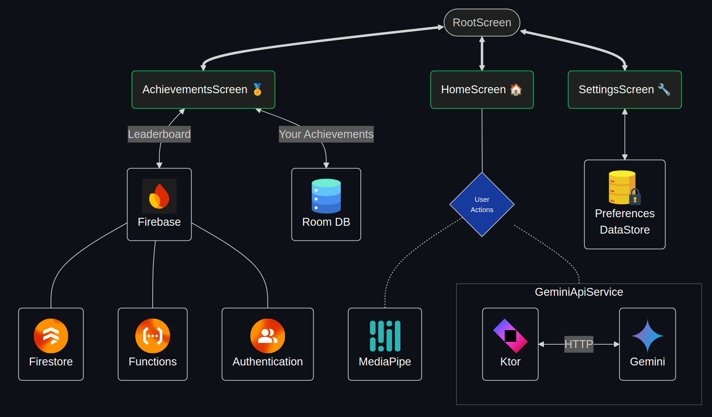

</img>
<p style="text-align: center">Object Detector</p>

## Demo 🎥

## Main Features ✨
- Detect very simple objects with MediaPipe
- Ask Gemini anything about a picture taken
- Tracks the user's achievements towards MediaPipe's detectable objects and provides a leaderboard for the users (that opted in by logging in with Google) towards those achievements
- It supports various customizations and other features: 
    - Camera settings: ratio, flashlight and saving pictures taken
    - Model settings: detection sensitivity, max detection count, detection animations and the model itself
    - Notifications for achievements

## Primary Technologies 🛠️
| MediaPipe | Gemini API | Ktor | Firebase |
|:-:|:-:|:-:|:-:|
|  |  |  |  |

### 1. [MediaPipe](https://github.com/google/mediapipe)
- An open-source framework from Google. It facilitates the integration of AI & ML into your applications. Here's a showcase of the [tasks MediaPipe supports](https://mediapipe-studio.webapps.google.com/home)
- I'm using the [Object Detection](https://ai.google.dev/edge/mediapipe/solutions/vision/object_detector/android) dependency and the provided pre-trained [models](https://ai.google.dev/edge/mediapipe/solutions/vision/object_detector#models), which can detect these [80 objects](https://storage.googleapis.com/mediapipe-tasks/object_detector/labelmap.txt)

### 2. [Gemini API](https://aistudio.google.com/app/apikey)
- A RESTful API for performing HTTP requests to a Gemini model,
running in Google Cloud Platform. Doesn't require a GCP project, although you can associate it to
one or monitor the use of your API key
- Pricing: It has a reasonable free tier of [1.5k requests per day and other limits](https://ai.google.dev/gemini-api/docs/billing#about-billing) for Gemini 1.5 Flash. [See it's capabilities and various details](https://ai.google.dev/gemini-api/docs/models/gemini#gemini-1.5-flash)

### 3. [Ktor (client)](https://ktor.io/docs/client-create-new-application.html)
- An open-source framework developed by JetBrains to create HTTP servers or clients
- I only use it's client component, in order to make HTTP calls to the Gemini API
- I use the built-in JSON serializer for sending and receiving objects

### 4. [Firebase](https://firebase.google.com/docs/build)
- A cloud platform or BaaS (Backend As A Service) that provides a range of utilities for different environments (and programming languages) via SDK's (Software Development Kits)
- I use it to store the achivement leaderboard of the users with [Cloud Firestore](https://firebase.google.com/docs/database/rtdb-vs-firestore?hl=en&authuser=0)
- Pricing: [Free tier](https://firebase.google.com/pricing)

## Secondary Technologies 🛠️
| [Koin](https://insert-koin.io/docs/quickstart/android-annotations/) |       [Lottie](https://airbnb.io/lottie/#/android-compose)       |                            [Mockk](https://mockk.io/)                             |                      [Coil](https://coil-kt.github.io/coil/)                      |                             [Jetpack Compose UI Test](https://developer.android.com/develop/ui/compose/testing)                              | 
|:-------------------------------------------------------------------:|:----------------------------------------------------------------:|:---------------------------------------------------------------------------------:|:---------------------------------------------------------------------------------:|:--------------------------------------------------------------------------------------------------------------------------------------------:|
|  |  |  |  |  |
|                      For dependency injection                       |                      For animated graphics                       |                            For object mocking in tests                            |                            For efficient & flexible image loading                            |                                                                 For UI tests                                                                 |

### Plugins Used & Other Dependencies 🔌
#### Gradle Plugins 🐘
- [gradle-download-task by Michel Krämer](https://github.com/michel-kraemer/gradle-download-task) -> To facilitate the download of the small TFlite ML models. It is ran automatically after building the project. In gradle tool window, access it in the task category "other"
- [Kotlin Serialization](https://kotlinlang.org/docs/serialization.html) -> Used to process Kotlin's @Serialization annotations
- [Kotlin Symbol Processing (KSP)](https://kotlinlang.org/docs/ksp-quickstart.html#add-a-processor) -> Used to process Koin's and Room's annotations and build the dependencies
- [Dokka](https://kotlinlang.org/docs/dokka-introduction.html) -> API documentation engine for KDocs comments. Run it via `./gradlew app:dokkaHtml`. Or in gradle tool window, access it in the task category "documentation"

#### Other Dependencies
- [androidx.camera.* dependencies](https://developer.android.com/jetpack/androidx/releases/camera)
- [google-accompanist](https://google.github.io/accompanist/) -> For permission utils
- [androix.datastore](https://developer.android.com/jetpack/androidx/releases/datastore) -> For the storage of user preferences
- [androidx.room](https://developer.android.com/jetpack/androidx/releases/room) -> For storage of more complex data-structures, like the achievements

## Setup Guide 🙌
[Gradle JDK](https://www.jetbrains.com/help/idea/gradle-jvm-selection.html#jvm_settings) used: JetBrains Runtime (JBR) 17.0.10

1. Getting API Keys 🔑
    - Gemini API -> https://aistudio.google.com/app/apikey
    - There's a link to this in the app too
2. Installing ⬇️
    - a) From .apk file: Download in [releases](https://github.com/p4ulor/Object-Detector-App/releases). Built with Github Actions
    - b) From source code: 
        - Connect your phone to the PC and run in a terminal at the root directory `./gradlew app:installDebug`
        - Or `./gradlew assembleDebug` to build a debug version, which will output an .apk file to `app/build/outputs/apk/debug`

## Core Tech Use Throughout The App (simplified)



<details closed>
<summary>More details</summary>

- [docs](./docs)

- [GH rendered Mermaid diagrams](./docs/mermaid-diagrams.md)
</details>

## Todo 
- installing through .apk not working "app not installed as package appears to be invalid"
- Add sfx
- Shrink and obfuscate apk https://developer.android.com/build/shrink-code#obfuscate using proguard. check results with https://github.com/Konloch/bytecode-viewer
- CI & CD:
  - https://docs.github.com/en/actions/using-github-hosted-runners/using-github-hosted-runners/about-github-hosted-runners
  - add docs github page https://github.com/p4ulor/Object-Detector-App/settings/pages
  - https://github.com/marketplace/actions/github-pages-overwriter
  - https://github.com/rayluo/github-pages-overwriter/blob/dev/action.yml
- https://gist.github.com/cobyism/4730490#gistcomment-1374989
  - https://github.com/skydoves/Balloon/blob/main/.github/workflows/release-docs.yaml
### Fixes To-do 🕒

- Not using the deprecated resolution selector causes
```
java.lang.RuntimeException: Buffer not large enough for pixels" at bitmapBuffer.copyPixelsFromBuffer
```
