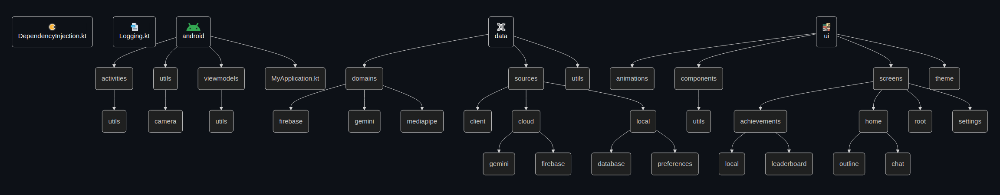

## Notes 📝
- The ML models used with MediaPipe need to be a compatible with it, the compatibility depends on the feature used. In the case of this app, it's a model made for Image Detection
- MediaPipe uses/is based on the TensorFlow Lite, and provides an easier way to add some basic ML capabilities to your apps. Checkout the [ML on Android with MediaPipe](https://www.youtube.com/playlist?list=PLOU2XLYxmsILZnKn6Erxdyhxmc3fxyitP) YT playlist.
- Apps that use MediaPipe will generally not run in phone emulators, you will need a physical Android device to run this app
- MediaPipe's runs the model on your phone's CPU or GPU (I set GPU by default).
- If the object detection outline isn't smooth, it's because you have toggled on the "Reduce Animations" in your Android's settings

## Technical documentation 📜
This text details things about conditions, state handling, decisions made, reminders, errors, user experience, etc. The actual details are in the code of course.

### HomeScreen 🏠
- Everytime the user navigates to this screen the preferences, secret preferences (gemini api key) and the unreached achievements are loaded
- When existing the screen or minimizing the app, the camera is unbinded
- Toggling on Gemini doesn't stop the image analysis from MediaPipe from running in the background because I didn't want to have to rebind the camera just to do so, but it stops the flow emissions of results
- For simplicity sake, only the latest message of Gemini is saved when the user leaves the screen or toggled off/on Gemini

### SettingsScreen 🔧
- Everytime the user navigates to this screen the preferences and secret preferences are loaded
- When the app that's installed doesn't have the MediaPipe models: The preferences are still set, but MediaPipe won't be running in the ImageAnalysis use case

### AchievementsScreen 🏅
- Everytime the user navigates to this screen, the list of achievements are loaded
- If a user deletes his account the top objects stats coming from that user won't be deleted. New object detections are counted to the stats by doing a diff between the achievements already in firestore and the ones submitted by the user

## Firebase
1.
- `google-services.json` should be placed in `app/`

## Firebase & Authentication 🛂
### Setup
- For properly setting up the Firebase project with authentication, a set of things must be done regarding the app signing and providing the SHA codes to the Firebase SDK setup for Android (the google-services.json). This will be used to authenticate the clients (android phones) doing requests to the Firebase project. You can change these SHA codes anytime, so you can leave it blank when creating the project's SDK.
- These changes will make so that trying to decompile the .apk and making any attempts to make requests with any other built app not valid.
1. Set up the [App signing](https://developer.android.com/studio/publish/app-signing#generate-key). This will be used when generating the SHA certificate fingerprints
2. Save the values and place them in `local.properties` (so you don't forget them. This is not checked in version control) like so
```cmake
# Should be set in Github Actions
RELEASE_JKS_FILE_BASE64= ... (see step 3)
RELEASE_JSK_PASSWORD=...
RELEASE_KEY_ALIAS=...
RELEASE_KEY_PASSWORD=...
```
3. The previous step should create an `app_certificate.jks` (Java KeyStore (JKS)) file. A better name could be `release.keystore`, but now I named it like this... 

Now, everytime you run `./gradlew signingReport` it should print an equal hashes for release, per example, unless you changed the passwords and stuff used to generate the .jks. The hash coming from release will then have to be added to the `google-services.json`. Example after running signingReport:

```cmake
Config: release
Store: /home/p4ulor/Object-Detector-App/app_certificate.jks
Alias: the_key_store_alias
MD5: ...
SHA1: 3B:CA:...
```

Then run
```cmake
base64 --wrap=0 app_certificate.jks > app_certificate.base64
```
and copy it's contents to the `RELEASE_JKS_FILE_BASE64` variable. The JKS file is converted to a Base64 string so it's easily set as a string environment variable in the Github Actions pipeline. The `build.gradle.kts` converts it back to a temp JKS file in order to work.

4. Go to the settings of the [environment variables for Github Actions](https://github.com/p4ulor/Object-Detector-App/settings/secrets/actions) and setup these strings as "Repository secrets". Then, convert your `google-services.json` to Base64 and also set it as a "Repository secret". Run 
```cmake
base64 --wrap=0 google-services.json > google_services_json.base64
```

5. The previous operations and variable names should match the code insiprevious step should cretring environment variable in Github Actions and be converted to a file that's placed in `app/` directory during the job execution (and before the gradle build step)
10. More info
   - https://developers.google.com/android/guides/client-auth
   - https://developer.android.com/studio/publish/app-signing
11. In essence, it can be said that the app is sufficiently safe with the `google-services.json` file in place because:
    - The API keys within `google-services.json` are platform-restricted to Android (lesser attack surface compared to allowing the web SDK per example)
    - With Firestore rules, only authenticated users can write to their own data
    - With Firestore rules, only authenticated users can read data. And the only authentication method is with Google
    - Apps with unrecognized hashes will not be able to connect to the firebase project, even for trying to obtain authentication (see `onFailure` of `signInWithGoogle()`).
    - And the most important step is to setup the Firebase project (and the app) with ["App Check"](https://firebase.google.com/docs/app-check?hl=en&authuser=0#how_is_related_to), which is complementary to the Firebase authentication. It offers periodic attestation of the app or device's authenticity by requiring API calls to contain a valid App Check token with an expiration date. It requires creating a Play Console developer account (costs 25 dollars) and associating a Google Play project to the Firebase project. This is where the gradle generated SHA-256 comes in. To configure App Check is pretty simple, just go to it's tab in Firebase, click register, add the SHA-256, and on API's tab check enforcement for Firestore. But I didn't do this because: I don't want to pay 25 dollars, I want to move on to other things and I don't want to complicate the app use and building for other devs so they can try it out more easily.
12. For testing outside of GH actions, you can set the environment variables (and rename some files that can be overwritten) in the terminal with `èxport GOOGLE_SERVICES_JSON=...` and then running the gradle script through the same terminal ` ./gradlew build -x test`

### Firebase rules (prod)
```javascript
rules_version = '2';

service cloud.firestore {
  match /databases/{database}/documents {
    // only authenticated users can read and only authenticated users can write to their own data
    match /users/{userId} {
    	allow read: if request.auth != null;
      allow write: if request.auth != null && request.auth.uid == userId;
    }
    
    match /top-users/{document=**} {
      allow read: if request.auth != null;
      // allow write: if request.auth != null; will only be writable by Cloud Functions since they use the admin SDK
    }
    
    match /top-objects/{document=**} {
      allow read: if request.auth != null;
      // allow write: if request.auth != null; will only be writable by Cloud Functions since they use the admin SDK
    }
  }
}
```
### Firebase rules (for archiving and disabling the project)
```javascript
rules_version = '2';

service cloud.firestore {
  match /databases/{database}/documents {
    match /{document=**} {
      allow read: false;
      allow write: false;
    }
  }
}
```

### Sign in with Google
- [Sign in with Google](https://developer.android.com/identity/sign-in/credential-manager-siwg) is done by using Credential Manager, a Jetpack API, not [using the outdated Google Sign-In for Android API](https://developer.android.com/identity/legacy/gsi). You can aos see the [firebase guide here](https://firebase.google.com/docs/auth/android/google-signin)

## Source Code Structure



## Main challenges
- Custom and made from the ground up floating action button and it's bounds and state handling
- GeminiChat feature, state management and persistence (could be improved, per example saving the whole conversation instead of the latest message when toggling on/off Gemini)

## Things that were not done for the sake of moving on to other things
- The data in viewmodels maybe could have been more organized. I could have added the "UseCases" pattern to encapsulate logic
- Not supporting the animated detection outlines for more than 1 object when detection animation is enabled, since an identifier is required for the animation to track something, that being 1 object, but MediaPipe doesn't provide identifiers (and it wouldn't make sense that it did). Guessing could be done with the positioning and size of the outline, but it would be overkill
- Not worrying about still using ImageDetectionUseCase when toggling Gemini mode. Only the emission of results is stopped. This was done like this in order to not restart (and interrupt) the camera preview, it's also faster this way.
- Not displaying the whole list of Gemini messages in the chat, but only displaying the latest one
- Not opening the Achievements screen when clicking on a new achievement notification, but only navigating to the MainActivity
- Not supporting zooming in with camera

### Resources
- https://github.com/google-ai-edge/mediapipe-samples/tree/main/examples/object_detection/android
- https://firebase.google.com/docs/samples?hl=en&authuser=0

### Trivia
- In the past before my decision to use Gemini, I intended to use [Text Generation](https://ai.google.dev/edge/mediapipe/solutions/genai/llm_inference/android) to simply talk about a MediaPipe detected object, but:
    - It would require the user to download a LLM to their phone. So I decided to go for the Gemini API.
    - The LLM Inference API supports these [types of models](https://ai.google.dev/edge/mediapipe/solutions/genai/llm_inference#models). The most lightwheight (1.30 GB) is:
[gemma-1.1-2b-it-cpu-int4, LiteRT/TFLite variation](https://www.kaggle.com/models/google/gemma/tfLite/gemma-1.1-2b-it-cpu-int4)
    - [mediapipe-samples - llm_inference](https://github.com/google-ai-edge/mediapipe-samples/tree/main/examples/llm_inference/android).

- Update, with Gemma 3, the model is 500MB which is much better
    - https://www.linkedin.com/posts/aleks-denisov_ai-edgeai-gemma-activity-7307364307208458240-tLBb

> [!NOTE]
> Use the following VSC extensions for better experience in markdown docs
> - https://marketplace.visualstudio.com/items?itemName=bierner.markdown-mermaid
> - https://marketplace.visualstudio.com/items?itemName=bierner.markdown-preview-github-styles

