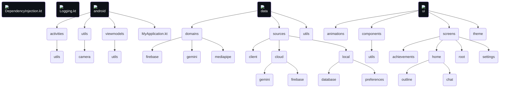

## Notes 📝
- The ML models used with MediaPipe need to be a compatible with it, the compatibility depends on the feature used. In the case of this app, it's a model made for Image Detection
- MediaPipe uses/is based on the TensorFlow Lite, and provides an easier way to add some basic ML capabilities to your apps. Checkout the [ML on Android with MediaPipe](https://www.youtube.com/playlist?list=PLOU2XLYxmsILZnKn6Erxdyhxmc3fxyitP) YT playlist.
- Apps that use MediaPipe will generally not run in phone emulators, you will need a physical Android device to run this app
- MediaPipe's runs the model on your phone's CPU or GPU (I set GPU by default).
- If the object detection outline isn't smooth, it's because you have toggled on the "Reduce Animations" in your Android's settings

## Technical documentation 📜
This text details things about conditions, state handling, decisions made, reminders, errors, user experience, etc. The actual details are in the code of course.

### HomeScreen 🏠
- Everytime the user navigates to this screen the preferences, secret preferences (gemini api key) and the unreached achievements are loaded
- When existing the screen or minimizing the app, the camera is unbinded
- Toggling on Gemini doesn't stop the image analysis from MediaPipe from running in the background because I didn't want to have to rebind the camera just to do so, but it stops the flow emissions of results
- For simplicity sake, only the latest message of Gemini is saved when the user leaves the screen or toggled off/on Gemini

### SettingsScreen 🔧
- Everytime the user navigates to this screen the preferences and secret preferences are loaded
- When the app that's installed doesn't have the MediaPipe models: The preferences are still set, but MediaPipe won't be running in the ImageAnalysis use case

### AchievementsScreen 🏅
- Everytime the user navigates to this screen, the list of achievements are loaded

## Authentication 🛂
- [App signing](https://developer.android.com/studio/publish/app-signing#generate-key) is used to authenticate the clients (android phones) doing requests to the Firebase project. So the SHA-1 that's used in production should be the one that's printed form the "release" signingConfig, which is shown when running `./gradlew signingReport`. 
- When setting up the "Add Firebase to your Android App" it asks for the "Debug signing certificate SHA-1", which I provide, so this should be changed when releases are provided or we need to see if we have another signature for releases so we can support both debug and release app instalations performing Firebase requests

The Java KeyStore file is converted to Build64 so it's easily set in the pipeline and `build.gradle.kts` converts it back to a temp JKS file.
```
base64 --wrap=0 app_certificate.jks > app_certificate.base64
```
## Source Code Structure



## Main challenges
- Custom and made from the ground up floating action button and it's bounds and state handling
- GeminiChat feature, state management and persistence (could be improved)

## Things that were not done for the sake of moving on to other things
- Not supporting the animated detection outlines for more than 1 object when detection animation is enabled, since an identifier is required for the animation to track something, that being 1 object, but MediaPipe doesn't provide identifiers (and it wouldn't make sense that it did). Guessing could be done with the positioning and size of the outline, but it would be overkill
- Not worrying about still using ImageDetectionUseCase when toggling Gemini mode. Only the emission of results is stopped.
- Not displaying the whole list of Gemini messages in the chat, but only displaying the latest one
- Not opening the Achievements screen when clicking on a new achievement notification, but only navigating to the MainActivity

### Resources
- https://github.com/google-ai-edge/mediapipe-samples/tree/main/examples/object_detection/android
- https://firebase.google.com/docs/samples?hl=en&authuser=0

### Trivia
- In the past before my decision to use Gemini, I intended to use [Text Generation](https://ai.google.dev/edge/mediapipe/solutions/genai/llm_inference/android)
    - But it would require the user to download a LLM to their phone. So I decided to go for the Gemini API.
    - The LLM Inference API support these [types of models](https://ai.google.dev/edge/mediapipe/solutions/genai/llm_inference#models). The most lightwheight (1.30 GB) is:
[gemma-1.1-2b-it-cpu-int4, LiteRT/TFLite variation](https://www.kaggle.com/models/google/gemma/tfLite/gemma-1.1-2b-it-cpu-int4)
    - [mediapipe-samples - llm_inference](https://github.com/google-ai-edge/mediapipe-samples/tree/main/examples/llm_inference/android).

- Update, with Gemma 3, the model is 500MB which is much better
    - https://www.linkedin.com/posts/aleks-denisov_ai-edgeai-gemma-activity-7307364307208458240-tLBb

> [!NOTE]
> Use the following VSC extensions for better experience in markdown docs
> - https://marketplace.visualstudio.com/items?itemName=bierner.markdown-mermaid
> - https://marketplace.visualstudio.com/items?itemName=bierner.markdown-preview-github-styles

