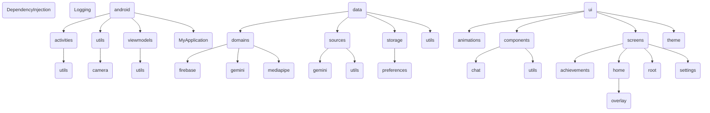

## Technical documentation
Details about conditions, state handling, errors, user experience, etc
### HomeScreen


### SettingsScreen
- When the app that's installed doesn't have the MediaPipe models: TODO
- 
### AchievementsScreen


## Authentication
[App signing](https://developer.android.com/studio/publish/app-signing#generate-key) is used to authenticate the clients (android phones) doing requests to the Firebase project. So the SHA-1 that's used in production should be the one that's printed form the "release" signingConfig, which is shown when running `./gradlew signingReport`. When setting up the "Add Firebase to your Android App" it asks for the "Debug signing certificate SHA-1", which I provide, so this should be changed when releases are provided or we need to see if we have another signature for releases so we can support both debug and release app instalations performing Firebase requests

The Java KeyStore file is converted to Build64 so it's easily set in the pipeline and `build.gradle.kts` converts it back to a temp JKS file.
```
base64 --wrap=0 app_certificate.jks > app_certificate.base64
```
## Source Code Structure



## Resources
- https://github.com/google-ai-edge/mediapipe-samples/tree/main/examples/object_detection/android
- https://firebase.google.com/docs/samples?hl=en&authuser=0