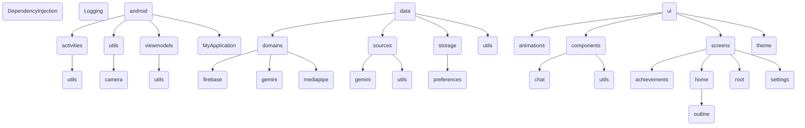

## Technical documentation
Details about conditions, state handling, errors, user experience, etc

### HomeScreen
- Everytime the user navigates to this screen the preferences are loaded
- When existing the screen or minimizing the app, the camera is unbinded
- Toggling on Gemini doesn't stop the image analysis from MediaPipe from running in the background because I didn't want to have to rebind the camera just to do so, but it stops the flow emissions of results
- For simplicity sake, only the latest message of Gemini is saved when the user leaves the screen or toggled off/on Gemini

### SettingsScreen
- Everytime the user navigates to this screen the preferences are loaded
- When the app that's installed doesn't have the MediaPipe models: The preferences are still step, but MediaPipe won't be running in the ImageAnalysis use case
### AchievementsScreen


## Authentication
[App signing](https://developer.android.com/studio/publish/app-signing#generate-key) is used to authenticate the clients (android phones) doing requests to the Firebase project. So the SHA-1 that's used in production should be the one that's printed form the "release" signingConfig, which is shown when running `./gradlew signingReport`. When setting up the "Add Firebase to your Android App" it asks for the "Debug signing certificate SHA-1", which I provide, so this should be changed when releases are provided or we need to see if we have another signature for releases so we can support both debug and release app instalations performing Firebase requests

The Java KeyStore file is converted to Build64 so it's easily set in the pipeline and `build.gradle.kts` converts it back to a temp JKS file.
```
base64 --wrap=0 app_certificate.jks > app_certificate.base64
```
## Source Code Structure



## Main challenges
- Custom and made from the ground up floating action button and it's bounds and state handling
- GeminiChat feature, state management and persistence (could be improved)

## Things that were not done for the sake of moving out to other things
- Animated detection outlines only support detection 1 type of object, since an identifier is required for the animation to track, but MediaPipe doesn't provide identifiers.
- Not worrying about still using ImageDetectionUseCase when toggling Gemini mode
- Displaying only the latest Gemini message when toggling off and on Gemini, instead of storing the list of messages
- The notification intent explicitly opening the Achivements screen instead of just pointing to the MainActivity
- Supporting Geminis response markdown format (see if it's feasible)

### Resources
- https://github.com/google-ai-edge/mediapipe-samples/tree/main/examples/object_detection/android
- https://firebase.google.com/docs/samples?hl=en&authuser=0

### Trivia
- In the past before my decision to use Gemini, I intended to use [Text Generation](https://ai.google.dev/edge/mediapipe/solutions/genai/llm_inference/android)
    - But it would require the user to download a LLM to their phone. So I decided to go for the Gemini API.
    - The LLM Inference API support these [types of models](https://ai.google.dev/edge/mediapipe/solutions/genai/llm_inference#models). The most lightwheight (1.30 GB) is:
[gemma-1.1-2b-it-cpu-int4, LiteRT/TFLite variation](https://www.kaggle.com/models/google/gemma/tfLite/gemma-1.1-2b-it-cpu-int4)
    - [mediapipe-samples - llm_inference](https://github.com/google-ai-edge/mediapipe-samples/tree/main/examples/llm_inference/android).
