### This will be here while Github doesn't support img tags in mermaid diagrams
- And is intended to be used for previewing with the recommended VSC extensions referenced at the docs [README](./README.md). You can also use [Mermaid chart](https://www.mermaidchart.com/) to explore Mermaid

### Tech Use Throughout The App (simplified)

```mermaid
%% TD -> Top-Down
    flowchart TD

%% Nodes
    %% Normal Nodes
        Root([RootScreen])
        HS(HomeScreen 🏠)
        AS(AchievementsScreen 🏅)
        SC(SettingsScreen 🔧)
        FAB{"<p style="font-size: 10px;"> User </br> Actions"}

    %% Icon Nodes
        DB("<img style="max-height: 50px; object-fit: contain" src='./imgs/db.png'> Room DB")
        FB("<img style="max-height: 50px; object-fit: contain" src="https://firebase.google.com/static/images/brand-guidelines/logo-logomark.png"> Firebase")
        FB_store("<img style="max-height: 50px; object-fit: contain" src="https://firebase.google.com/static/images/products/icons/build_firestore.svg"> Firestore")
        FB_auth("<img style="max-height: 50px; object-fit: contain" src="https://firebase.google.com/static/images/products/icons/build_auth.svg"> Authentication")
        FB_functions("<img style="max-height: 50px; object-fit: contain" src="https://firebase.google.com/images/products/icons/build_functions.svg"> Functions")


        PD("<img style="max-height: 50px; object-fit: contain" src='./imgs/db-encrypted.png'> Preferences </br> DataStore")

        MP("<img style="max-height: 50px; object-fit: contain" src='../app/src/main/res/drawable/mediapipe.png'> MediaPipe")
        GEM("<img style="max-height: 50px; object-fit: contain" src='../app/src/main/res/drawable/gemini.png'> Gemini")
        KTOR("<img style="max-height: 50px; object-fit: contain" src="https://resources.jetbrains.com/storage/products/company/brand/logos/Ktor_icon.png"> Ktor")

%% Connections
    Root <==> AS
    Root <==> HS
    Root <==> SC
    HS --- FAB 

    FAB -.- MP
    FAB -.- GeminiApiService

    subgraph GeminiApiService
        direction LR
        KTOR <-- HTTP --> GEM
    end
    
    AS <-- Your Achievements --> DB
    AS <-- Leaderboard --> FB

    FB --- FB_store
    FB --- FB_functions
    FB --- FB_auth

    SC <--> PD

%% Styling. #0d1117 = github dark color
    %% Definitions
    classDef screenStyle color:#FFFFFF, stroke:#00C853
    classDef noBackgroundStyle color:#FFFFFF, fill:#0d1117

    %% Definitions applied
    class HS,SC,AS screenStyle
    class DB,FB,FB_store,FB_auth,FB_functions,PD,MP,GEM,KTOR,GeminiApiService noBackgroundStyle

    %% Direct style definitions
    style FAB color:#FFFFFF, fill:#163a9e 
```

### Source Code Structure

